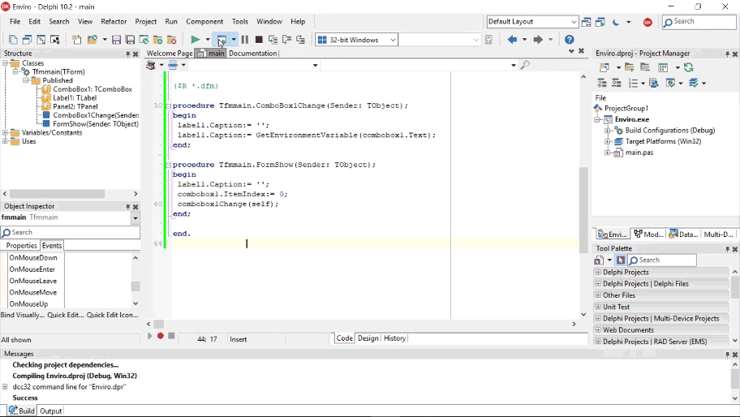

**Delphi using Environment Variables in your App**

Environment Variables can help you extract data that require some in-depth
coding to achieve the same result. So here is a simple way to replace lengthy
legacy code or create some new code with

function GetEnvironmentVariable(const Name: string): string; found in the
*System.SysUtils* library.

**What it is?**

The ‘**GetEnvironmentVariable’** method is a way to retrieve the value of an
environment variable passed as a string (name) for the current process using a
standard list of Windows based variables that can be extracted.

**How useful is it?**

These Environment Variables are a standard across all OS’s and for different
processors thereby ensuring that there is no requirements for ‘**IFDEFs’**.

I found it useful to extract :-

-   certain directories such as ‘**Appdata**’ that calls the Roaming directory.

-   to determine / show who has logged onto the Windows machine.

-   extract the CMD.exe directory using ‘**Comspec**’.

-   Obtaining the OS Processor info.

-   obtaining the ‘**Tmp / Temp’** drive for processing.

Check out the simple App that calls each Environment Variable via a combobox
that shows the result real time on your Windows machine. Perhaps there are a few
other options that you could find useful.

Here is the list of the Standard Environment Variables.

| **Environment variable name**  | **Environment value**                                                    |
|--------------------------------|--------------------------------------------------------------------------|
| ALLUSERSPROFILE                | Generic user profile.                                                    |
| APPDATA                        | Path of the application data folder.                                     |
| CLIENTNAME                     | Name of Client machine.                                                  |
| COMMONPROGRAMFILES             | Path of common program files folder.                                     |
| COMPUTERNAME                   | Name of Computer code is running on.                                     |
| COMSPEC                        | Path of the cmd.exe program.                                             |
| HOMEDRIVE                      | Current home drive designation, such as 'C:'                             |
| HOMEPATH                       | Path to current location for document storage.                           |
| LOGONSERVER                    | Specifies a domain controller for user logon authentication.             |
| NUMBER_OF_PROCESSORS           | Number of processors on current machine.                                 |
| OS                             | Base name of the Operating System.                                       |
| PATH                           | The current program path.                                                |
| PATHEXT                        | Extension types of executable files.                                     |
| PROCESSOR_ARCHITECTURE         | Type of CPU architecture. For example, X86 for Intel Pentium processors. |
| PROCESSOR_IDENTIFIER           | ID number of current machine.                                            |
| PROCESSOR_LEVEL                | More detailed description of the CPU architecture.                       |
| PROCESSOR_REVISION             | Processor revision level.                                                |
| PROGRAMFILES                   | Path of the program files folder.                                        |
| SESSIONNAME                    | Name of the current OS session.                                          |
| SYSTEMDRIVE                    | Drive the OS operates from.                                              |
| SYSTEMROOT                     | Sets the system directory.                                               |
| TEMP                           | Path of the temporary files folder.                                      |
| TMP                            | Directory to store temporary files to.                                   |
| USERDOMAIN                     | Specifies the domain of the current machine.                             |
| USERNAME                       | Name of the current user.                                                |
| USERPROFILE                    | Path of the folder holding the current user's information.               |
| WINDIR                         | Path of the Windows folder.                                              |

Feel free to view this blog and others in Bayeseanblog…

<http://www.bayeseanblog.com>

Happy Coding
